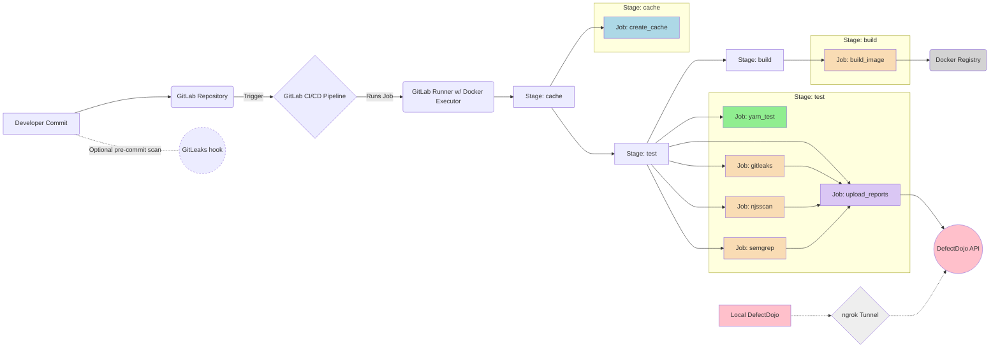
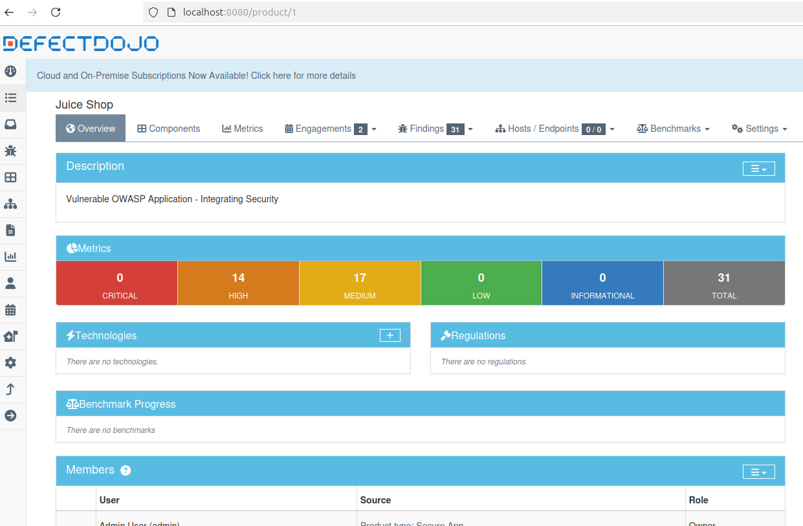

<!-- TOC --><a name="cicd-security-pipeline-for-owasp-juice-shop"></a>
# CI/CD Security Pipeline for OWASP Juice Shop

This project implements a fully automated DevSecOps pipeline using GitLab CI, purpose-built around the intentionally vulnerable OWASP Juice Shop application. The pipeline integrates security checks into each commit, enabling early detection of vulnerabilities and routing results to a centralized DefectDojo dashboard for triage and tracking.

Each run executes GitLeaks, njsscan, and Semgrep in parallel. Scan outputs are uploaded automatically to DefectDojo, where findings are deduplicated, categorized, and retained for remediation tracking. Caching is used to minimize setup time, and the full workflow completes in under ten minutes on a standard GitLab shared runner.

The pipeline is designed for portability and reproducibility - scanner configurations, Docker build logic, and infrastructure are consistent across CI and local environments. All credentials are securely handled via GitLab CI/CD variables, and Docker Compose is available for local testing.

## Table of Contents
- [CI/CD Security Pipeline for OWASP Juice Shop](#cicd-security-pipeline-for-owasp-juice-shop)
   * [Getting Started](#getting-started)
      + [Steps to Reproduce](#steps-to-reproduce)
   * [Pipeline Highlights](#pipeline-highlights)
   * [Pipeline Architecture](#pipeline-architecture)
      + [Workflow Diagram](#workflow-diagram)
      + [CI Configuration and Pipeline Overview](#ci-configuration-and-pipeline-overview)
   * [Pipeline Stages](#pipeline-stages)
      + [Stage 1: Dependency Caching (`cache`)](#stage-1-dependency-caching-cache)
      + [Stage 2: Test and Security Validation (`test`)](#stage-2-test-and-security-validation-test)
         - [GitLeaks: Secret Detection](#gitleaks-secret-detection)
         - [Static Analysis: njsscan and Semgrep](#static-analysis-njsscan-and-semgrep)
         - [DefectDojo Upload Integration](#defectdojo-upload-integration)
      + [Stage 3: Build and Push (`build`)](#stage-3-build-and-push-build)
   * [Centralized Vulnerability Management](#centralized-vulnerability-management)
      + [CI Job: `upload_reports`](#ci-job-upload_reports)
      + [Automated Report Upload Logic](#automated-report-upload-logic)
      + [Centralized Reporting](#centralized-reporting)
   * [Remediations Triggered by Pipeline Findings](#remediations-triggered-by-pipeline-findings)
      + [Cryptographic Weakness: MD5 to SHA-256](#cryptographic-weakness-md5-to-sha-256)
      + [Mitigating SQL Injection via Parameterized Queries](#mitigating-sql-injection-via-parameterized-queries)
   * [Technologies and Implementation Overview](#technologies-and-implementation-overview)
      + [Key Components and Their Role in the Pipeline](#key-components-and-their-role-in-the-pipeline)
   * [References](#references)
<!-- TOC --><a name="getting-started"></a>
## Getting Started

The full pipeline can be run remotely - no local runner required. Setup takes just a few minutes, and once configured, each commit will trigger a complete scan and container build.

<!-- TOC --><a name="steps-to-reproduce"></a>
### Steps to Reproduce

1. **Fork or import this repository** into your GitLab group.
    
2. **Add the required CI/CD variables** under  
    `Settings → CI/CD → Variables`:
    
    |Variable|Purpose|
    |---|---|
    |`DOJO_URL`|Base URL of your DefectDojo instance. You can use the public demo (`https://demo.defectdojo.org`) or spin up a local instance and expose it with `ngrok` (e.g. `https://abc123.ngrok.io`).|
    |`DEFECTDOJO_API_KEY`|API token from Dojo (User → API Key v2).|
    |`DOJO_ENGAGEMENT_ID`|ID of the DefectDojo engagement to send findings to (currently fixed).|
    | `DOCKER_USER` / `DOCKER_PASS` | Docker Hub credentials used to push the image defined in `IMAGE_NAME`. These should be valid independent credentials. |
    
3. **Push a commit** (even a README change) to trigger the pipeline. The following steps run automatically:
    
    - GitLeaks, njsscan, and Semgrep run in parallel.
    - Scan results are uploaded to DefectDojo via `upload_reports.py`.
    - The Docker image is built and pushed to the configured registry.

No further configuration or local setup is required.

> **Optional:** To test locally, run the official DefectDojo `docker-compose.yml`, expose it with `ngrok`, and set `DOJO_URL` to the forwarding address.

---

<!-- TOC --><a name="pipeline-highlights"></a>
## Pipeline Highlights

| **Area**              | **What It Delivers**                                                      | **How It's Implemented**                                                         |
| --------------------- | ------------------------------------------------------------------------- | -------------------------------------------------------------------------------- |
| CI/CD Execution       | Parallel scanning, caching, and structured stage flow                     | GitLab CI (`.gitlab-ci.yml`), `needs`, `cache`, Docker executor                  |
| Secret Scanning       | GitLeaks runs on every commit, with noise filtered via config             | `.gitleaks.toml`, Git history scan, directory allowlists                         |
| Static Analysis       | Layered SAST using njsscan and Semgrep for broader vulnerability coverage | njsscan (Node.js-specific), Semgrep (JS ruleset), SARIF/JSON reports             |
| Centralized Reporting | All findings are pushed to DefectDojo for triage and tracking             | Python script with API integration (`upload_reports.py`, `/api/v2/import-scan/`) |
| Secure Image Delivery | Container builds are automatically pushed after passing scans             | Docker-in-Docker (`docker:24-dind`), `docker login` with masked CI variables     |
| Reproducibility       | Fully remote setup, with optional local demo using Docker Compose         | One-time variable setup, no need for local runner                                |
___
<!-- TOC --><a name="pipeline-architecture"></a>
## Pipeline Architecture

<!-- TOC --><a name="workflow-diagram"></a>
### Workflow Diagram

The following diagram illustrates the flow of code from developer commit through the automated CI/CD pipeline stages, including security scanning and reporting to DefectDojo.


<!-- TOC --><a name="ci-configuration-and-pipeline-overview"></a>
### CI Configuration and Pipeline Overview

The pipeline is defined in `.gitlab-ci.yml` and structured into three stages: `cache`, `test`, and `build`. Each job executes in an isolated container environment, with the project directory initialized at the repository root (`.`) for consistency.

```yaml
variables:
  IMAGE_NAME: dkhanduke/demo-app
  IMAGE_TAG: juice-shop-1.1

stages:
  - cache
  - test
  - build
```

Dependencies use caching to minimize setup time across runs. Security scans, report uploads, and image builds are fully automated.

---
<!-- TOC --><a name="pipeline-stages"></a>
## Pipeline Stages

The CI/CD pipeline is structured into three stages: **cache → test → build**. Each stage is optimized to provide feedback, integrate security scanning early, and produce a container image ready for deployment.
___
<!-- TOC --><a name="stage-1-dependency-caching-cache"></a>
### Stage 1: Dependency Caching (`cache`)

This stage installs and caches Node.js dependencies using Yarn to speed up the pipeline. The cache is tied to the `yarn.lock` file, meaning any changes to dependency versions will automatically refresh the cache. If the lock file hasn’t changed, the cached `node_modules/` is reused across pipeline runs.

```yaml
cache:
  key:
    files:
      - yarn.lock
  paths:
    - node_modules/
    - yarn.lock
    - .yarn
  policy: pull-push
```

- Based on the `node:18-bullseye` image with Yarn pre-installed.
- Restores dependencies early to accelerate test and build stages.
- Ensures installs are consistent with the locked dependency tree.

---
<!-- TOC --><a name="stage-2-test-and-security-validation-test"></a>
### Stage 2: Test and Security Validation (`test`)

This stage runs five parallel jobs to validate both application behavior and code security.

|Job|Description|Blocks Pipeline|Output Artifact|
|---|---|---|---|
|`yarn_test`|Executes unit and integration tests|Yes|–|
|`gitleaks`|Scans for hardcoded secrets|No|`gitleaks.json`|
|`njsscan`|Static analysis for Node.js vulnerabilities|No|`njsscan.sarif`|
|`semgrep`|Pattern-based SAST for JavaScript|No|`semgrep.json`|
|`upload_reports`|Uploads scan results to DefectDojo|Yes|–|

Security jobs are marked `allow_failure: true`, allowing the pipeline to complete even if vulnerabilities are detected. This enables vulnerability tracking without interrupting delivery, and allows remediation to be prioritized over time in line with best practices.
___
<!-- TOC --><a name="gitleaks-secret-detection"></a>
#### GitLeaks: Secret Detection

GitLeaks scans the working directory and Git history for exposed secrets. The scan runs in a container and generates a structured JSON report.

```yaml
script:
  - gitleaks detect --source . -f json -r gitleaks.json
allow_failure: true
artifacts:
  paths:
    - gitleaks.json
```

Even if secrets are found, the job won’t fail the pipeline. Results are forwarded to DefectDojo for review.

To reduce false positives from test files and mock data, the pipeline includes a `.gitleaks.toml` configuration:

```toml
[extend]
useDefault = true

[allowlist]
paths = ['test', '.*\/test\/.*']
```

This keeps the default detection rules active while skipping files under any `test/` directory or matching the regex pattern. It improves signal quality by focusing alerts on real secrets and ignoring static test data.

> **Optional: Client-Side Pre-Commit Hook**
> 
> A pre-commit hook can be added to catch secrets before they’re committed. In this setup, a simple script inside `.git/hooks/` uses the GitLeaks Docker image:
> 
> ```bash
> docker pull zricethezav/gitleaks:latest
> export path_to_host_folder_to_scan=~/path/to/app
> docker run -v ${path_to_host_folder_to_scan}:/path zricethezav/gitleaks:latest detect --source="/path" --verbose
> ```
> 
> This adds a layer of protection during development. Once a secret is committed, it's considered compromised - even if deleted later.

---
<!-- TOC --><a name="static-analysis-njsscan-and-semgrep"></a>
#### Static Analysis: njsscan and Semgrep

This stage applies layered static analysis using two scanners in parallel:

```yaml
script:
  - njsscan --exit-warning . --sarif -o njsscan.sarif
```

```yaml
script:
  - semgrep ci --json --output semgrep.json
```

- **njsscan** targets Node.js-specific issues like insecure patterns and deprecated APIs.
- **Semgrep** runs broader JavaScript rulesets to catch logic flaws and code-level misconfigurations.

Each tool detects different classes of vulnerabilities, which helps improve overall coverage. Using both reduces blind spots and increases confidence in scan results.

The resulting artifacts are passed to the next stage for centralized reporting.
___
<!-- TOC --><a name="defectdojo-upload-integration"></a>
#### DefectDojo Upload Integration

After scanning, all results are automatically uploaded to OWASP DefectDojo using a tailored Python script. The developed script maps each report to its appropriate `scan_type`, as required by DefectDojo’s API, and submits it to the `/api/v2/import-scan/` endpoint.

```yaml
script:
  - python3 upload_reports.py gitleaks.json
  - python3 upload_reports.py njsscan.sarif
  - python3 upload_reports.py semgrep.json
```

Inside the script:

```python
if file_name == 'gitleaks.json':
    scan_type = 'Gitleaks Scan'
elif file_name == 'semgrep.json':
    scan_type = 'Semgrep JSON Report'
elif file_name == 'njsscan.sarif':
    scan_type = 'SARIF'
```

These `scan_type` values are defined by DefectDojo and required when submitting scans via its API. The mapping ensures each report is interpreted correctly.

- The script reads the API key and base URL from GitLab CI/CD variables (`DEFECTDOJO_API_KEY`, `DOJO_URL`).
- Each report is submitted to `https://<DOJO_URL>/api/v2/import-scan/` using a `multipart/form-data` POST request.
- Reports are linked to a fixed engagement ID to keep findings organized.
- The job runs even if scanners detect issues, as long as the artifacts are available.

___
<!-- TOC --><a name="stage-3-build-and-push-build"></a>
### Stage 3: Build and Push (`build`)

The final stage compiles the application into a Docker image and pushes it to a remote container registry using credentials securely managed via GitLab CI/CD variables.

```yaml
before_script:
  - echo "$DOCKER_PASS" | docker login -u "$DOCKER_USER" --password-stdin
script:
  - docker build -t "$IMAGE_NAME:$IMAGE_TAG" .
  - docker push "$IMAGE_NAME:$IMAGE_TAG"
```

- Runs in a Docker-in-Docker (`docker:24-dind`) environment to enable full CLI functionality.
- Builds the image from the repository root, using tags (`$IMAGE_NAME:$IMAGE_TAG`) defined in the pipeline.
- Pushes the image to a target registry using masked credentials stored as CI/CD variables.

Once this stage is reached, the output is a validated and versioned container image, with all tests and security scans completed, ready for deployment or continued integration
___
<!-- TOC --><a name="centralized-vulnerability-management"></a>
## Centralized Vulnerability Management

All scan results from GitLeaks, njsscan, and Semgrep are automatically pushed to **OWASP DefectDojo**, which consolidates findings into a single dashboard for review and tracking. This removes the need to manually review raw `.json` or `.sarif` outputs and ensures a consistent triage process.

- Each scanner generates a structured report artifact during the pipeline.
- Once the artifacts are available, the `upload_reports` job runs automatically.
- A Python script (`upload_reports.py`) reads environment variables and submits each report to DefectDojo’s `/api/v2/import-scan/` endpoint.
- Reports are mapped to the correct `scan_type` and linked to a fixed engagement for consistent organization.

All findings are centralized, deduplicated, and retained for tracking and remediation. DefectDojo allows to sort by severity, assign owners, and track remediation status over time.
___
<!-- TOC --><a name="ci-job-upload_reports"></a>
### CI Job: `upload_reports`

The `upload_reports` job is responsible for uploading scan results to DefectDojo. It runs in a Python environment, installs the `requests` library, and invokes `upload_reports.py` for each report file.

```yaml
upload_reports:
  stage: test
  image: python
  needs: [gitleaks, njsscan, semgrep]
  when: always
  before_script:
    - pip3 install requests
  script:
    - python3 upload_reports.py gitleaks.json
    - python3 upload_reports.py njsscan.sarif
    - python3 upload_reports.py semgrep.json
```

The `needs` field ensures this job runs only after `gitleaks`, `njsscan`, and `semgrep` have completed. The `when: always` flag allows it to proceed even if one or more scanners detect issues - as long as the artifacts are available. This ensures all findings are uploaded to DefectDojo automatically on every pipeline run.

___
<!-- TOC --><a name="automated-report-upload-logic"></a>
### Automated Report Upload Logic

The `upload_reports.py` script is responsible for uploading individual scan reports to DefectDojo. It takes a single argument (the filename), determines the type of scan based on the filename, and then sends it to the correct DefectDojo API endpoint.

```python
if file_name == 'gitleaks.json':
    scan_type = 'Gitleaks Scan'
elif file_name == 'semgrep.json':
    scan_type = 'Semgrep JSON Report'
elif file_name == 'njsscan.sarif':
    scan_type = 'SARIF'
else:
    print(f"Unknown file type: {file_name}")
    sys.exit(1)

data = {
    "scan_type": scan_type,
    "engagement": 2,
    "active": True,
    "verified": True,
    "minimum_severity": "Low",
}
```

- Uses GitLab CI/CD environment variables to read the API key and DefectDojo URL.
- Sensitive values (like the API token) are stored as masked CI variables for security.
- Exits cleanly with a message if the scan type isn’t recognized.
- Sends reports using a `multipart/form-data` POST request to `/api/v2/import-scan/`.
- Interprets a successful upload by checking for an HTTP 201 status code.

For the complete implementation, see `upload_reports.py` in the root of this repository.
<!-- TOC --><a name="centralized-reporting"></a>
### Centralized Reporting

All scan results from the pipeline are automatically uploaded to **DefectDojo** and linked to a dedicated test engagement ID. This enables centralized tracking and simplifies security analysis.

```python
data = {
    'scan_type': scan_type,
    'active': True,
    'verified': True,
    'minimum_severity': 'Low',
    'engagement': 2
}
```

- Findings from all tools are consolidated into a single dashboard.
- Results are deduplicated and grouped by severity, tool, and timestamp.
- Issues can be assigned, tracked, and marked as mitigated to support remediation efforts.
- Historical data is retained to monitor trends and track security improvements over time.


___
<!-- TOC --><a name="remediations-triggered-by-pipeline-findings"></a>
## Remediations Triggered by Pipeline Findings

The pipeline follows a shift-left approach and supports remediation as early as possible in the development process. Findings from GitLeaks, njsscan, and Semgrep are automatically sent to DefectDojo, which provides context, specifically affected line numbers and file paths.

Below are example remediations that were implemented directly in the OWASP Juice Shop application based on these scan results.

<!-- TOC --><a name="cryptographic-weakness-md5-to-sha-256"></a>
### Cryptographic Weakness: MD5 to SHA-256

The **njsscan** tool flagged a single vulnerability: the use of MD5 to generate file checksums in `Gruntfile.js`. While the OWASP Juice Shop application contains several known issues, this was the only one detected by the scanner - emphasizing the importance of deploying a layered security approach.

Although MD5 works, it’s deprecated due to known collision vulnerabilities and is no longer considered secure for integrity validation.

**Vulnerability:**

```javascript
const md5 = crypto.createHash('md5')
md5.update(buffer)
const md5Hash = md5.digest('hex')
const md5FileName = 'dist/' + file + '.md5'
grunt.file.write(md5FileName, md5Hash)
```

**Remediation:**

```javascript
const sha256 = crypto.createHash('sha256')
sha256.update(buffer)
const sha256Hash = sha256.digest('hex')
const sha256FileName = 'dist/' + file + '.sha256'
grunt.file.write(sha256FileName, sha256Hash)
```

This change upgrades the hashing algorithm to SHA-256, a secure and accepted standard. The file extension was also updated. After implementing the fix and rerunning the pipeline, the njsscan job passes successfully, confirming that the issue has been resolved.
___
<!-- TOC --><a name="mitigating-sql-injection-via-parameterized-queries"></a>
### Mitigating SQL Injection via Parameterized Queries

The Semgrep scan identified multiple vulnerabilities, including an SQL injection vulnerability in the product search feature. The issue was that user input `criteria` was being inserted directly into the SQL query as raw text, which could allow an attacker to manipulate the database query.

This finding was automatically uploaded to DefectDojo, which provided a detailed breakdown including the file path and line number:

```
juice-shop/data/static/codefixes/dbSchemaChallenge_3.ts:11
```

**Vulnerability**:

```typescript
models.sequelize.query("SELECT * FROM Products WHERE ((name LIKE '%"+criteria+"%' OR description LIKE '%"+criteria+"%') AND deletedAt IS NULL) ORDER BY name")
```

The code constructed a SQL query by directly embedding user input into the query string. Malicious input from an attacker could break the query structure leading to unauthorized modifications and/or access. 

**Remediation:**

```typescript
models.sequelize.query(
  "SELECT * FROM Products WHERE ((name LIKE :searchQuery OR description LIKE :searchQuery) AND deletedAt IS NULL) ORDER BY name",
  {
    replacements: {
      searchQuery: '%' + criteria + '%'
    },
    type: models.sequelize.QueryTypes.SELECT
  }
)
```

The query was updated to use Sequelize’s (an ORM library for Node.js - provides high-level api to interact with sql databases) built-in parameterization method. Now, instead of inserting unsanitized user input, Sequelize safely inserts it as a value using `:searchQuery`. This prevents SQL injection.

After we pushed the fix, the CI pipeline ran again, uploaded the updated scan to DefectDojo, and confirmed the vulnerability was no longer present. 
___
<!-- TOC --><a name="technologies-and-implementation-overview"></a>
## Technologies and Implementation Overview

The pipeline integrates open-source tools and GitLab CI/CD features to embed security into the development lifecycle. Components are modular and focused: dependency caching, static analysis, secret detection, report upload, and centralized tracking. The setup is designed to be reproducible and supports fast, testable feedback during development.
<!-- TOC --><a name="key-components-and-their-role-in-the-pipeline"></a>
### Key Components and Their Role in the Pipeline

| **Category**               | **Tool / Feature**                           | **Purpose / Implementation**                                                                                         |
| -------------------------- | -------------------------------------------- | -------------------------------------------------------------------------------------------------------------------- |
| **CI/CD Orchestration**    | GitLab CI/CD (`.gitlab-ci.yml`)              | Defines staged pipeline (`cache → test → build`), manages job dependencies (`needs:`)                                |
| **Dependency Caching**     | GitLab Cache                                 | Speeds up installs by caching Yarn artifacts (`node_modules/`, `.yarn`, `yarn.lock`)                                 |
| **Secret Detection**       | GitLeaks                                     | Scans working tree and history - tuned via `.gitleaks.toml` to ignore known-safe test files & reduce false positives |
| **Static Analysis**        | njsscan, Semgrep                             | Parallel SAST tools for Node.js vulnerabilities and JS logic flaws                                                   |
| **Centralized Reporting**  | Python script (`upload_reports.py`)          | Converts and uploads scan results to DefectDojo using the v2 API (`/api/v2/import-scan/`)                            |
| **Vulnerability Platform** | OWASP DefectDojo                             | Aggregates findings, deduplicates results, and supports triage workflows                                             |
| **Containerization**       | Docker + Docker-in-Docker (`docker:24-dind`) | Builds and pushes images from CI using masked Docker registry credentials                                            |
| **Local Reproducibility**  | Docker Compose                               | Launches a testable DefectDojo instance for offline verification and pipeline validation                             |
| **Credential Handling**    | GitLab CI/CD variables                       | Secures secrets like `DOCKER_PASS`, `DEFECTDOJO_API_KEY` via protected, masked CI variables                          |

This pipeline demonstrates how security automation can be embedded directly into development workflows using open-source tools and a structured CI/CD approach.
___
<!-- TOC --><a name="references"></a>
## References

- OWASP Juice Shop Project: [https://owasp.org/www-project-juice-shop/](https://owasp.org/www-project-juice-shop/)
- GitLab CI/CD Documentation: [https://docs.gitlab.com/ci/](https://docs.gitlab.com/ci/)
- GitLeaks Documentation: [https://github.com/gitleaks/gitleaks](https://github.com/gitleaks/gitleaks)
- njsscan Documentation: [https://github.com/ajinabraham/njsscan](https://github.com/ajinabraham/njsscan)
- Semgrep Website: [https://semgrep.dev/](https://semgrep.dev/)
- Semgrep JavaScript Rules: [https://semgrep.dev/r?q=p/javascript](https://semgrep.dev/r?q=p/javascript)
- OWASP DefectDojo Project: [https://owasp.org/www-project-defectdojo/](https://owasp.org/www-project-defectdojo/)
- DefectDojo API v2 Documentation: [https://documentation.defectdojo.com/integrations/api/v2-api-information/](https://documentation.defectdojo.com/integrations/api/v2-api-information/) (Link updated to official docs)
- Docker Login (`--password-stdin`): [https://docs.docker.com/engine/reference/commandline/login/#provide-a-password-using-stdin](https://docs.docker.com/engine/reference/commandline/login/#provide-a-password-using-stdin)
- Static Analysis Results Interchange Format (SARIF): [https://docs.oasis-open.org/sarif/sarif/v2.1.0/os/sarif-v2.1.0-os.html](https://docs.oasis-open.org/sarif/sarif/v2.1.0/os/sarif-v2.1.0-os.html)
- Shift Left Security Concept: [https://www.redhat.com/en/topics/devops/what-is-shift-left-testing](https://www.redhat.com/en/topics/devops/what-is-shift-left-testing)